# TwoPassword

## Screenshots

1. Login

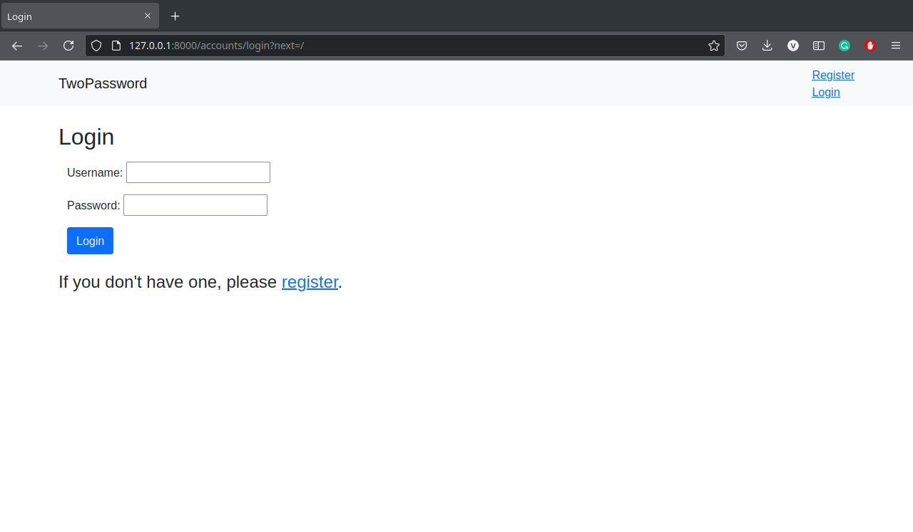

2. Register

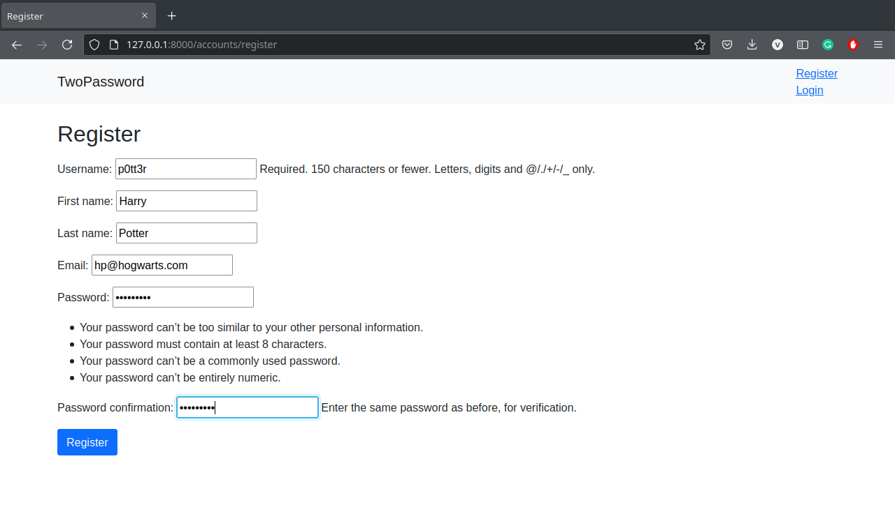

3. Login (after creating an account)

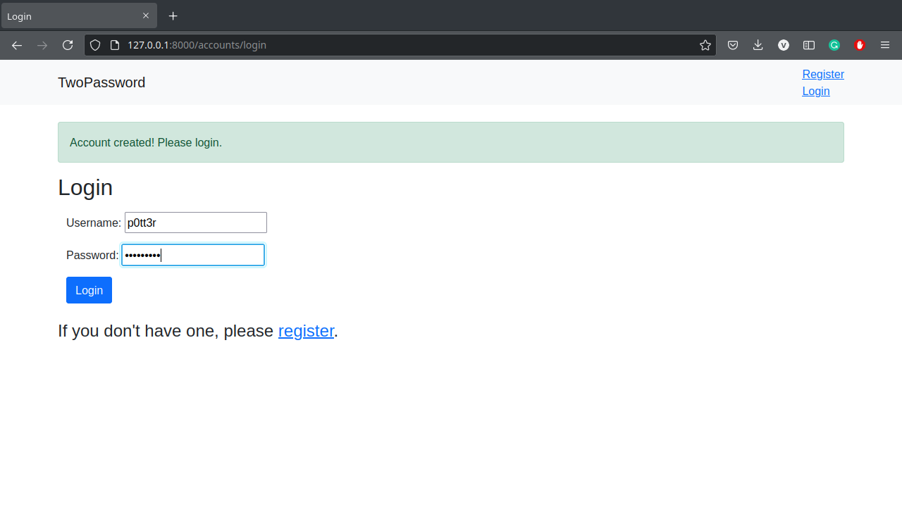

4. Account Profile

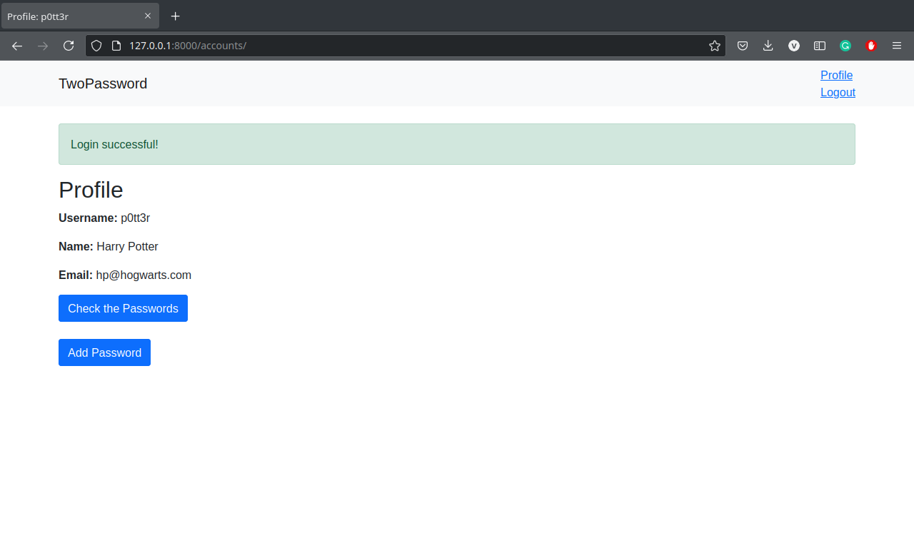

5. Dashboard (initially empty)

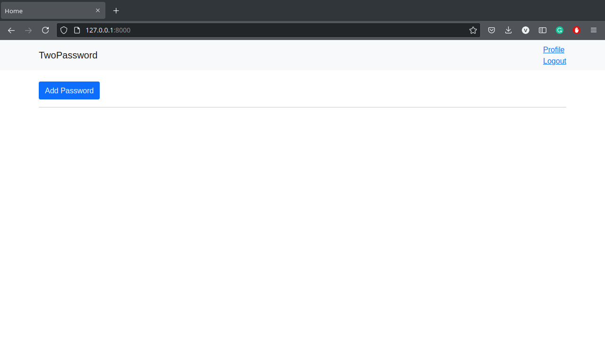

6. Add Password

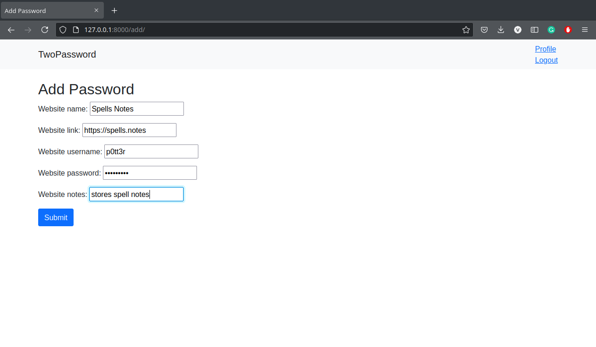

7. Dashboard

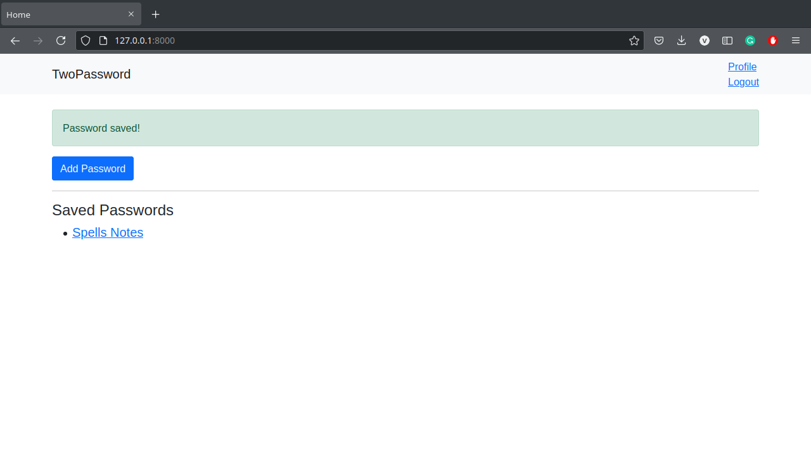

8. View Password

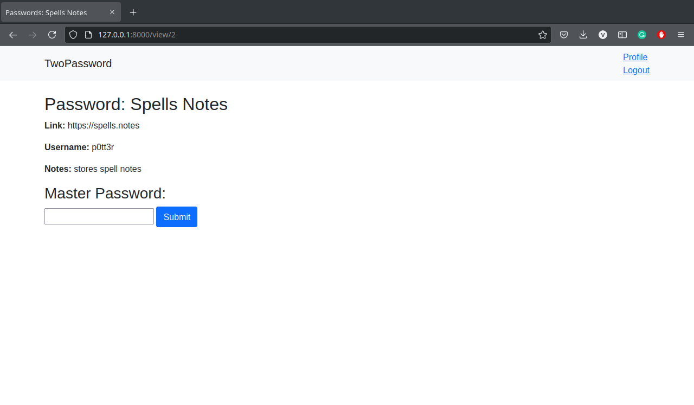

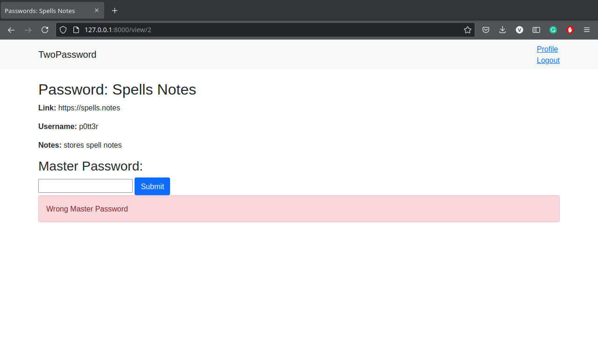

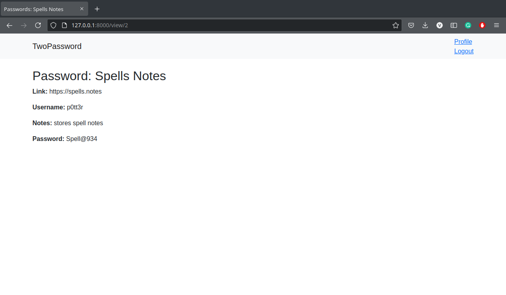

9. Logout

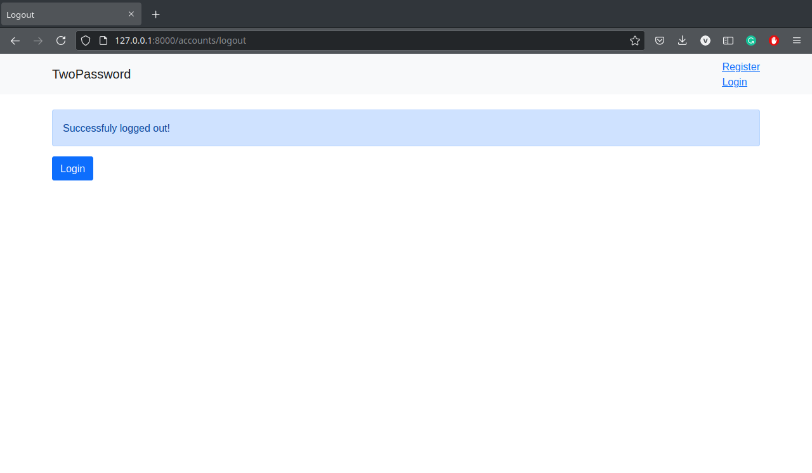
